# guided--landscape-imageGen-diffusion
*Read this in [English](README_EN.md)*

## 注意
### 问题
该项目后续不再更新
- 问题1：模型设计出现问题
- 问题2：模型训练出现问题
- 问题3：正在进行另一个相似的图像合成任务，后续会开源该相似任务
### 解决
- Q1：重新设计模型(对齐kv维度，对齐mask)
- Q2: stage1训练加上均值方差约束,stage2使用更大批次（128）平均
- Q3: 已完成，等待开源


## 问题介绍
图像生成任务一直以来都是十分具有应用场景的计算机视觉任务，从语义分割图生成有意义、高质量的图片仍然存在诸多挑战，如保证生成图片的真实性、清晰程度、多样性、美观性等。
其中，条件图像合成，即输入图片数据，合成真实感图片，在内容生成与图片编辑领域有广泛应用。一种条件图像合成的方式是，用两张图片作为输入，经过处理转换后生成一张新的图片，其中一张输入为语义分割图片（称为mask图），指示生成图片（称为gen图）的语义信息；另一张输入为参考风格图片（称为ref图），从色调等方面指示gen图的风格信息

参考: https://www.educoder.net/competitions/Jittor-4

## 训练数据
清华大学计算机系图形学实验室从Flickr官网收集了12000张高清（宽512、高384）的风景图片，并制作了它们的语义分割图。其中，10000对图片被用来训练。**其中 label 是值在 0~28 的灰度图**

签包括29类物体，分别是

```
"mountain", "sky", "water", "sea", "rock", "tree", "earth", "hill", "river", "sand", "land", "building", "grass", "plant", "person", "boat", "waterfall", "wall", "pier", "path", "lake", "bridge", "field", "road", "railing", "fence", "ship", "house", "other" 
```

## 网络架构(旧)


## 网络架构(新)


## 训练
环境：分别(stage)在RTX4090 24G, Tesla V100 32G，Tesla A100 80G

训练时间:在RTX4090,V100,A100, 训练一轮vae约1.5-2h, 训练一轮unet约2-2.5h

训练命令: <code>python3 MainTrain.py</code>

测试命令: <code>python3 MainTest.py</code>

## 注意
1. 代码未完成
2. 在stage2, unet正常训练,固定stage1所训练的vae

## Training procedure
### VAE
#### 0-2 epoch
- batch size = 1 
- loss fun: L1loss
- gradient accumulation batch = 4
- optimizer = AdamW(train_lr = 1e-5, adam_betas = (0.5, 0.999), weight_decay=0.01, eps=1e-8)
- step0:<div align=center>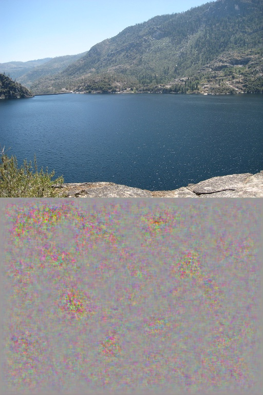</div>
- step100:<div align=center>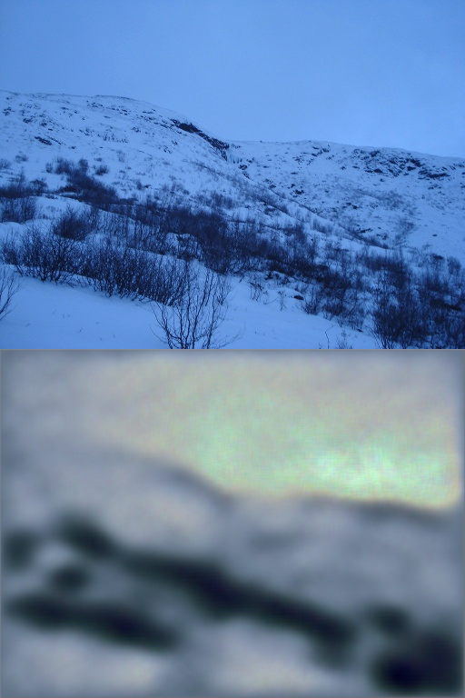</div>
- step20000:<div align=center>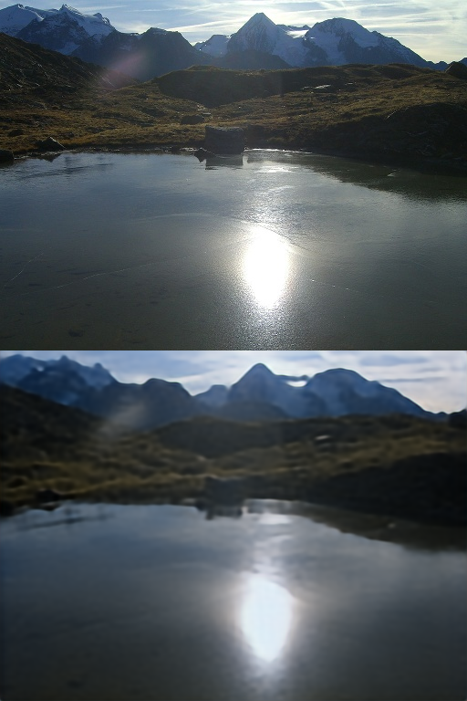</div>
#### 3-8 epoch
- batch size = 2 
- loss fun: L1loss
- gradient accumulation batch = 4
- optimizer = AdamW(train_lr = 1e-5, adam_betas = (0.5, 0.9), weight_decay=0.01, eps=1e-8)
- step10000: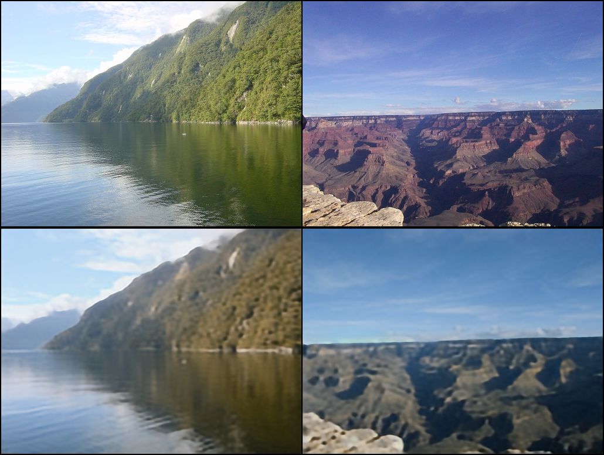
- step30000: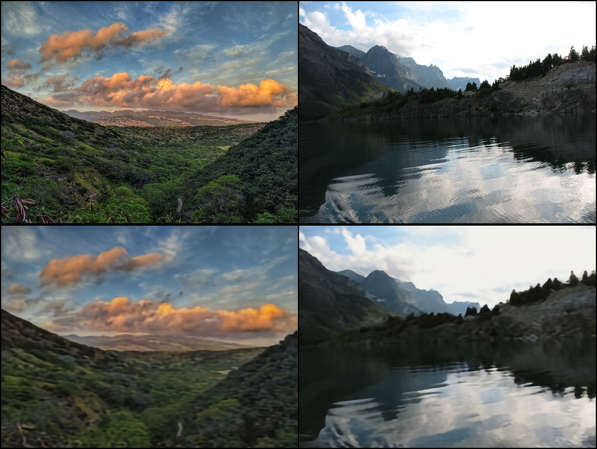
- step35000: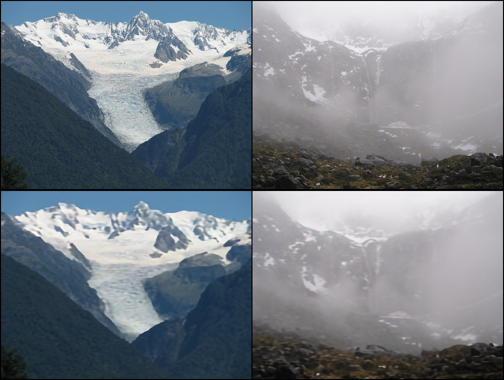
- step40000:
#### 9-20 epoch
- batch size = 3 
- loss fun: L1loss
- gradient accumulation batch = 1
- optimizer = AdamW(train_lr = 1e-4, adam_betas = (0.9, 0.999), weight_decay=0.01, eps=1e-8)
- step28000: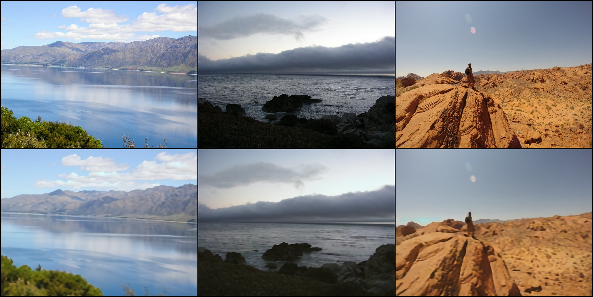
- step29900: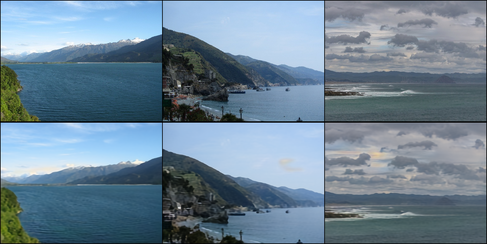
- step48000: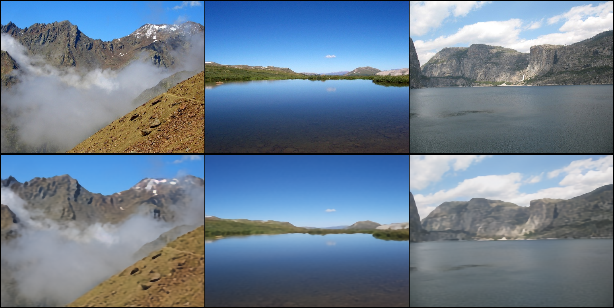
- step50000: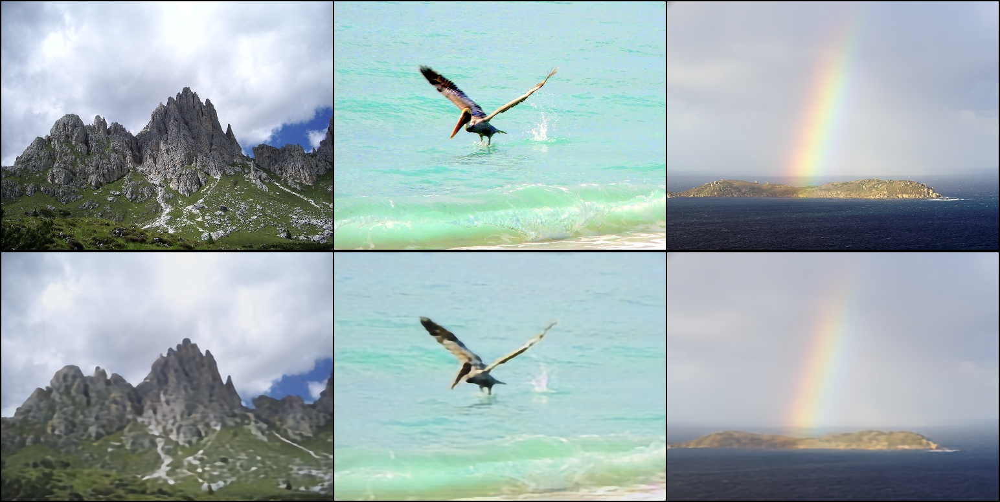

#### 21-100 epoch
- batch size = 3
- loss fun: L1loss
- gradient accumulation batch = 1
- optimizer = AdamW(train_lr = 5e-5, adam_betas = (0.9, 0.999), weight_decay=0.01, eps=1e-8)
- lr_scheduler = exp

- step55000: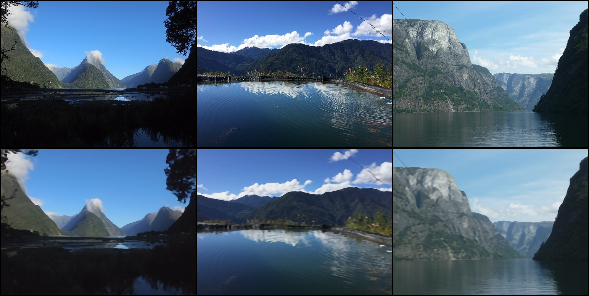
- step63000: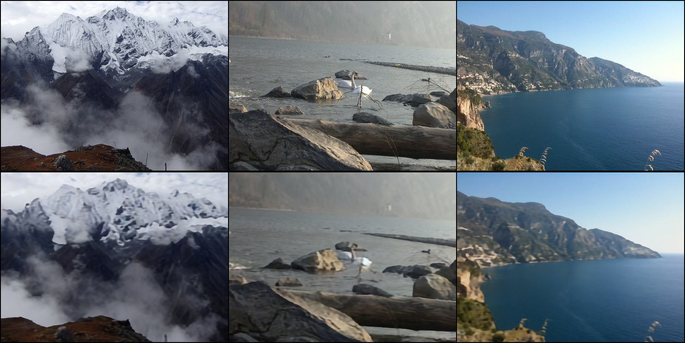
- step68000: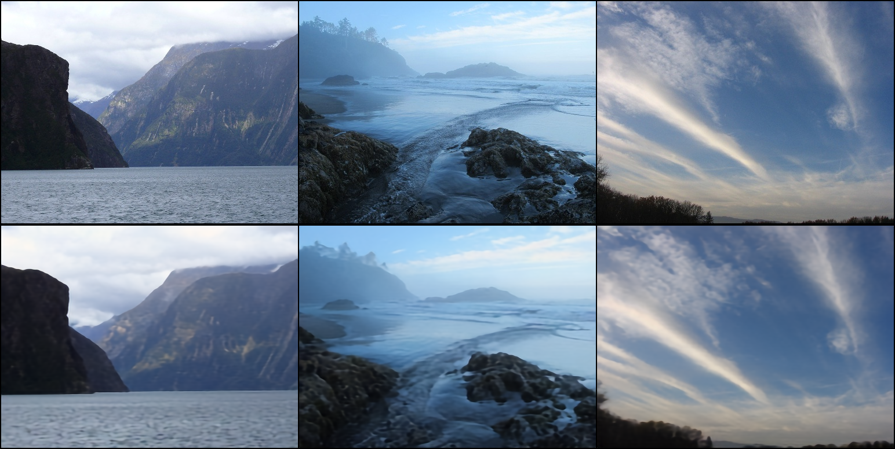
- step160000: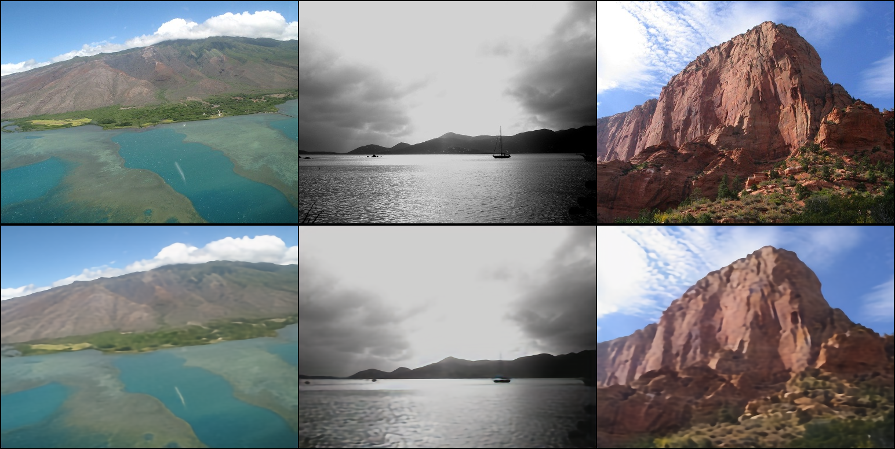
- step163200: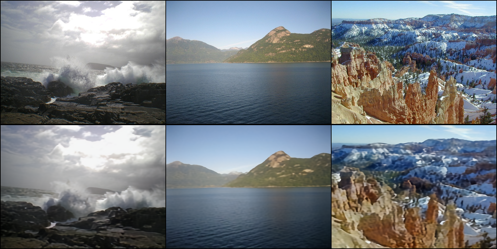
### 无条件 Unet
效果很差，图片尺寸可能太大了,训练过程
#### -200 epoch
- batch size = 1
- loss fun: L1loss
- gradient accumulation batch = 4
- optimizer = AdamW(train_lr = 1e-4, adam_betas = (0.9, 0.999), weight_decay=0.01, eps=1e-8)
- lr_scheduler = exp
- rtx3090 * 4

- step3200: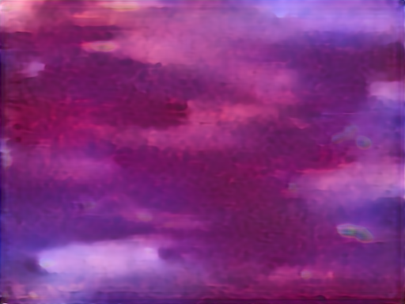
- step3300: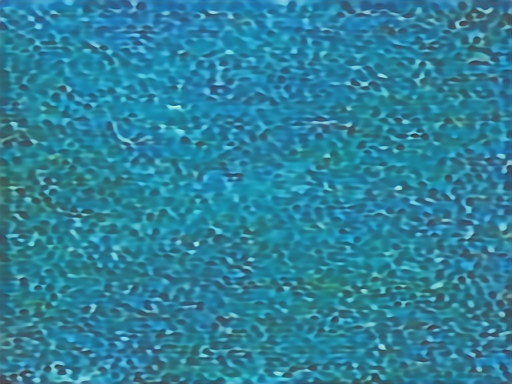
- step23100: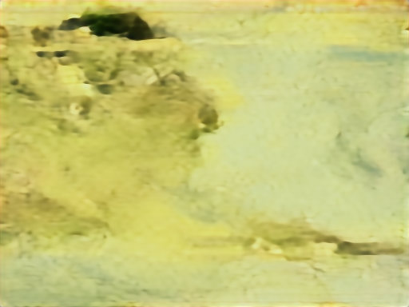
- step23200: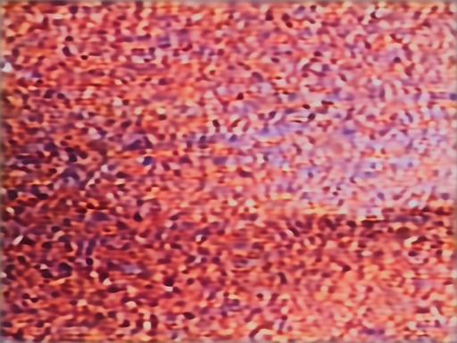
- step37800: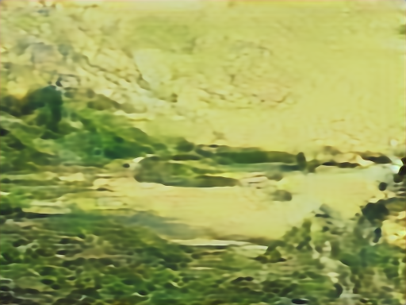
- step37900: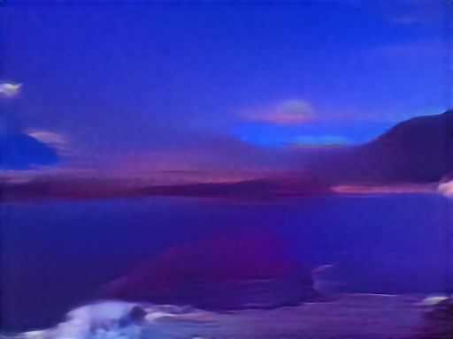
- step43800: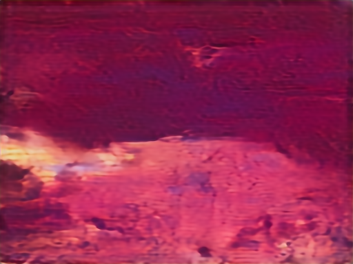
- step43900: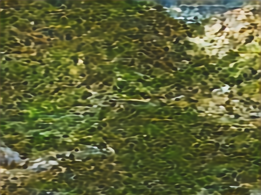
- step115600: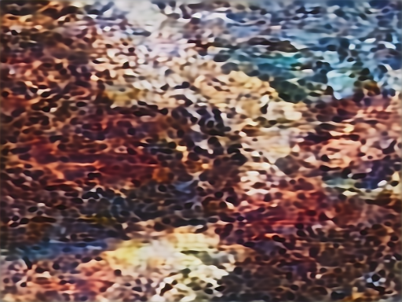
- step115700: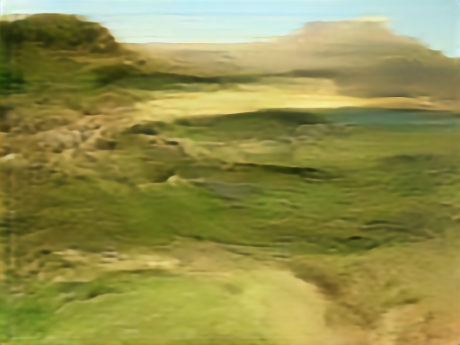
- step115800: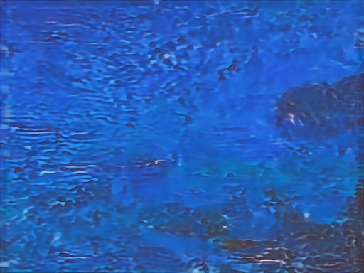

## TODO
1. 增加学习率调整
2. 将生成的Gen连续超分
3. 使用低阶矩阵秩分解，将Unet的attention层M\*N的矩阵分解为[M\*d] * [d\*N],使用语义分割信息再次训练加强分割控制性
