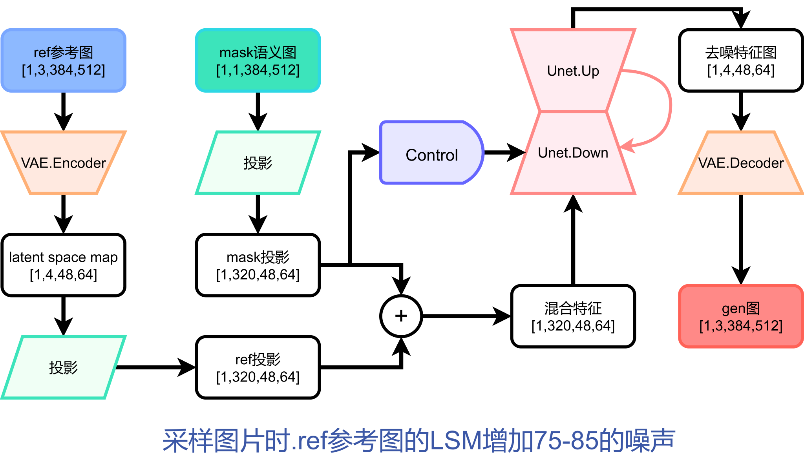

# guided--landscape-imageGen-diffusion
## 问题介绍
图像生成任务一直以来都是十分具有应用场景的计算机视觉任务，从语义分割图生成有意义、高质量的图片仍然存在诸多挑战，如保证生成图片的真实性、清晰程度、多样性、美观性等。
其中，条件图像合成，即输入图片数据，合成真实感图片，在内容生成与图片编辑领域有广泛应用。一种条件图像合成的方式是，用两张图片作为输入，经过处理转换后生成一张新的图片，其中一张输入为语义分割图片（称为mask图），指示生成图片（称为gen图）的语义信息；另一张输入为参考风格图片（称为ref图），从色调等方面指示gen图的风格信息

## 训练数据
高清（宽512、高384）的风景图片imgs，和它们的语义分割图labels。其中 label 是值在 0~28 的灰度图。

## 网络架构

## 训练
环境：分别在RTX4090 24G, Tesla V100 32G，Tesla A100 80G

训练时间:在RTX4090,V100,A100, 训练一轮vae约1.5-2h, 训练一轮unet约2-2.5h

## 注意
代码未完成,vae训练第二轮突然出现崩塌

## TODO
1.将生成的Gen连续超分

2.使用低阶矩阵秩分解，将Unet的attention层M*N的矩阵分解为[M*d] * [d*N],使用语义分割信息再次训练加强分割控制性
