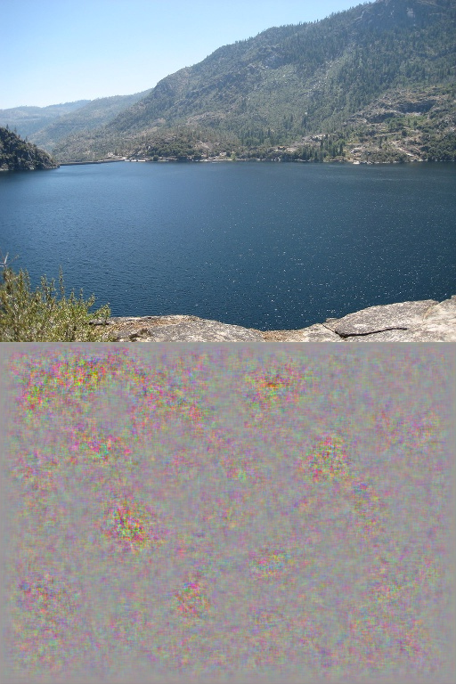
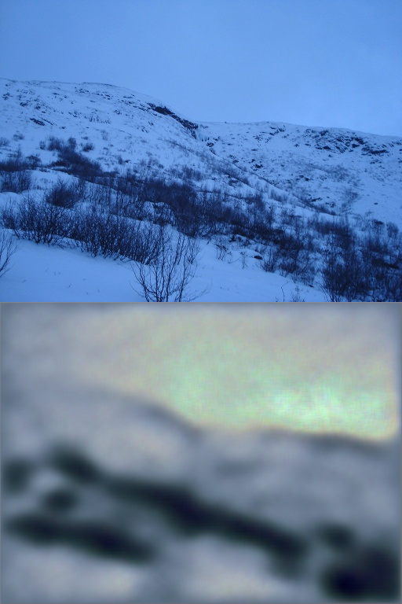
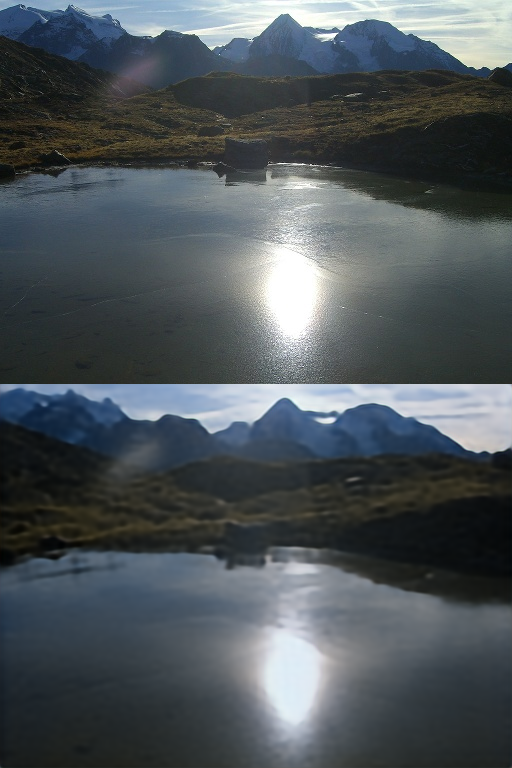
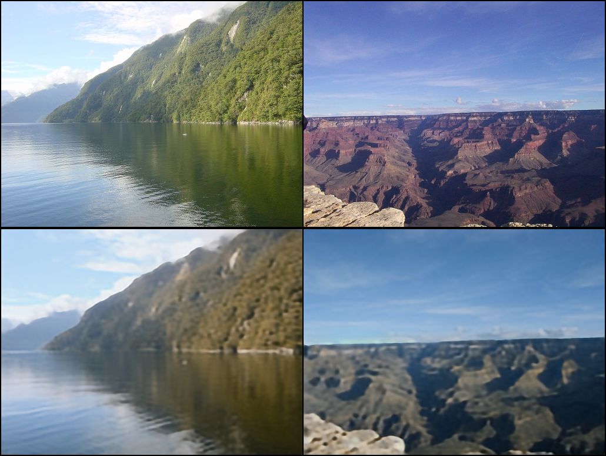
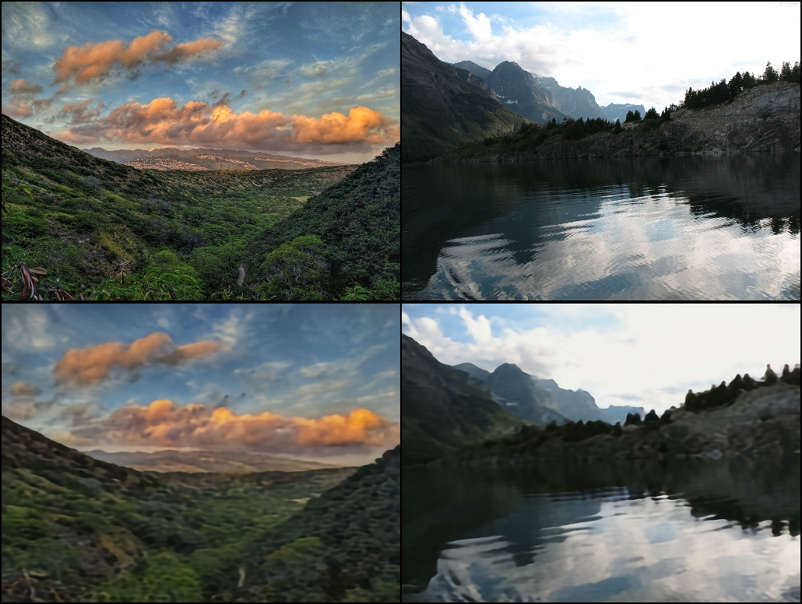
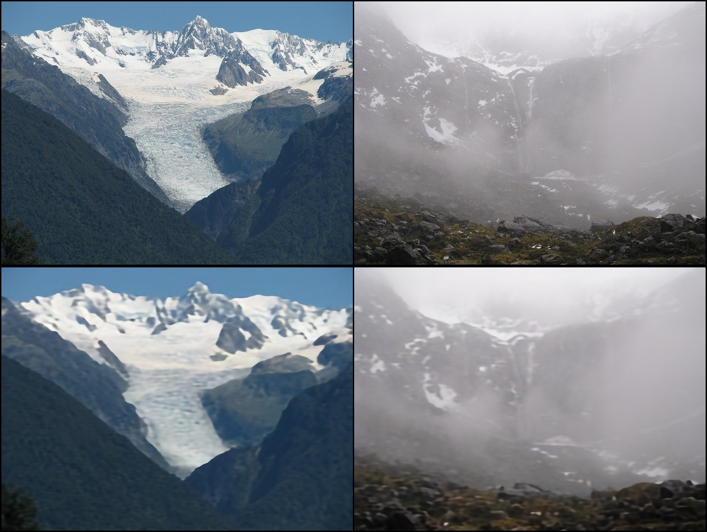
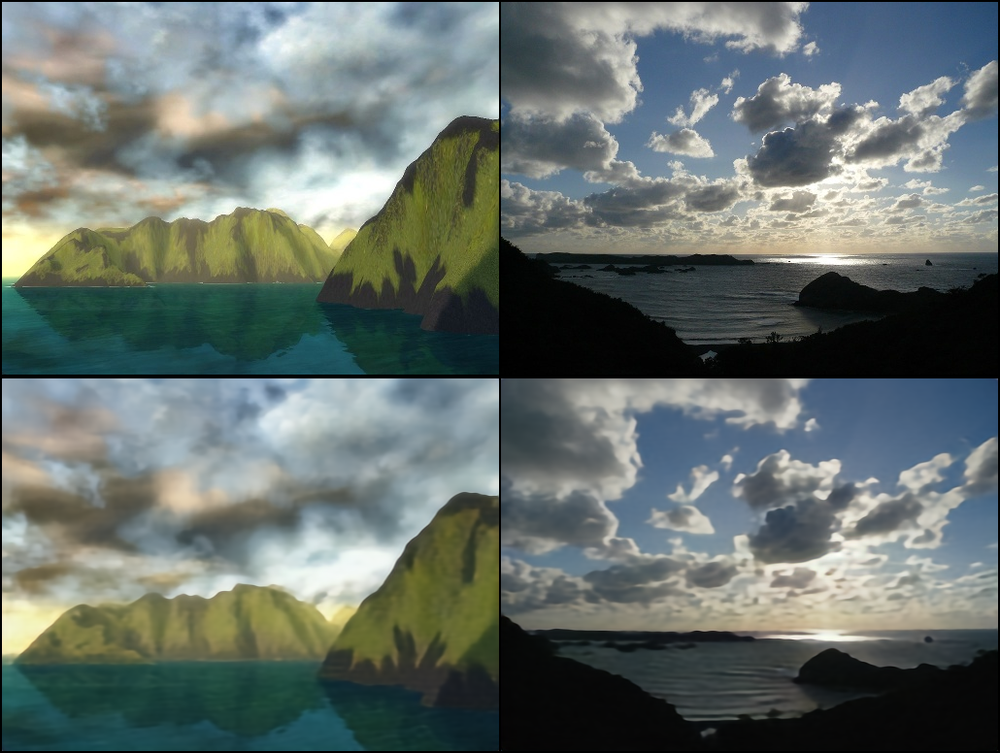
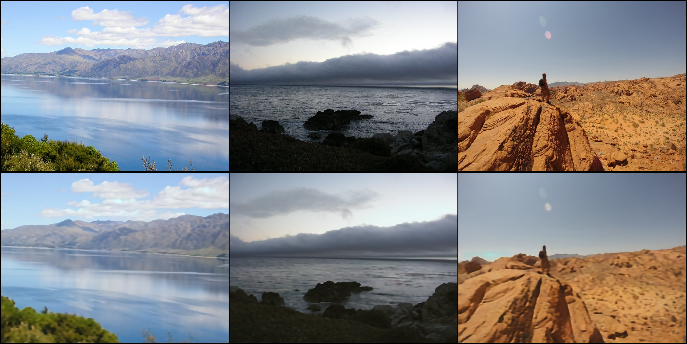
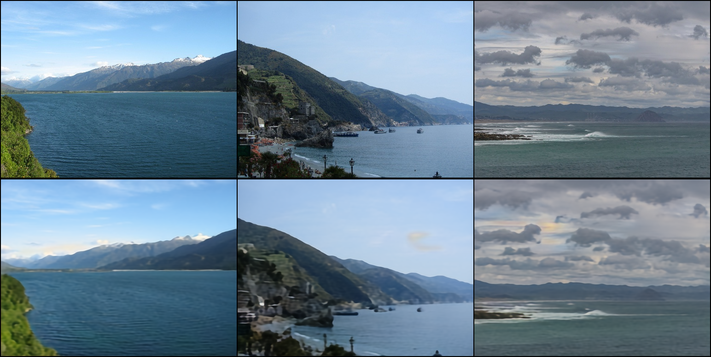

# guided--landscape-imageGen-diffusion
*使用 [中文](README.md) 阅读*
## Introduction

image generation tasks have been very application scenario computer vision tasks, and there are still many challenges in generating meaningful, high-quality images from semantic segmentation graphs, such as ensuring the authenticity, clarity, diversity, and aesthetics of the generated images. Among them, conditional image synthesis, i.e., inputting image data and synthesizing realistic images, is widely used in the field of content generation and image editing. One way of conditional image synthesis is to use two images as input, which are processed and transformed to generate a new image, where one input is a semantic segmentation image (called mask graph) indicating the semantic information of the generated image (called gen graph), and the other input is a reference style image (called ref graph) indicating the style information of the gen graph in terms of hue and other aspects

Reference: https://www.educoder.net/competitions/Jittor-4

## Training data

HD (512 wide, 384 high) landscape images imgs, and their semantic segmentation maps labels. where label is a grayscale map with values from 0 to 28.

## Architecture

## Training

Environment: RTX4090 24G, Tesla V100 32G, Tesla A100 80G respectively

Training time:In RTX4090,V100,A100, training vae one epoch about 1.5-2h, training unet one epoch about 2-2.5h

Training commands: <code>python3 MainTrain.py</code>

Testing commands: <code>python3 MainTest.py</code>

## Note
1. Code is not completed
2. In stage2, unet trained normally, fixed the vae trained in stage1

## Training procedure
### VAE
#### 0-2 epoch
- batch size = 1 
- optimizer = AdamW(train_lr = 1e-5, adam_betas = (0.5, 0.999), weight_decay=0.01, eps=1e-8)
- step0:

- step100:

- step20000:

#### 3-8 epoch
- batch size = 2 
- optimizer = AdamW(train_lr = 1e-5, adam_betas = (0.5, 0.9), weight_decay=0.01, eps=1e-8)
- step10000:
- step30000:
- step35000:
- step40000:
#### 9-11 epoch
- batch size = 3 
- optimizer = AdamW(train_lr = 1e-4, adam_betas = (0.9, 0.999), weight_decay=0.01, eps=1e-8)
- step28000:
- step29900:
#### 100 epoch
- TODO Finish 100 round

### Unet
- TODO

## TODO
1. Adding modules for learning rate adjustment
2. Apply continuous super-resolution to the generated Gen
3. Using ControlNet with LoRA
