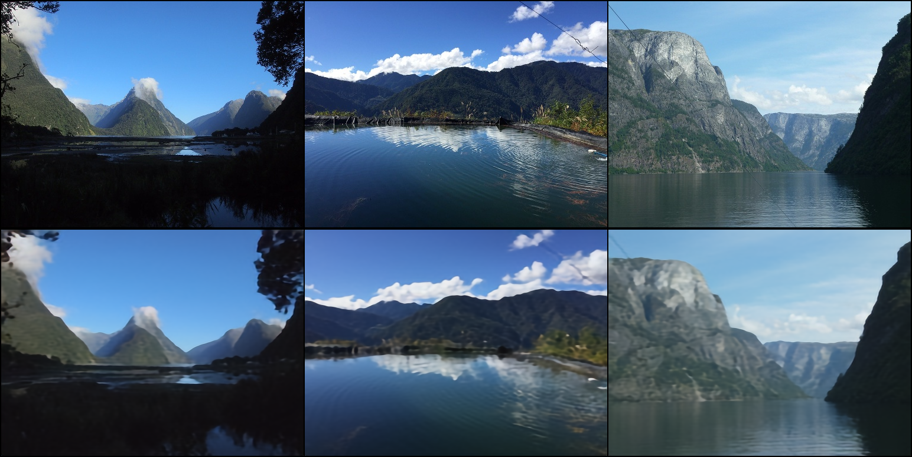
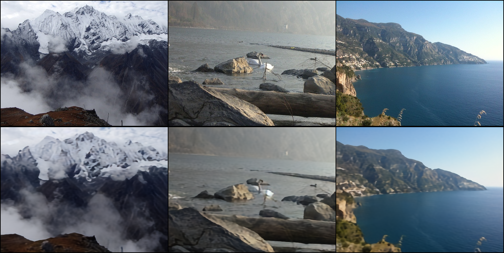
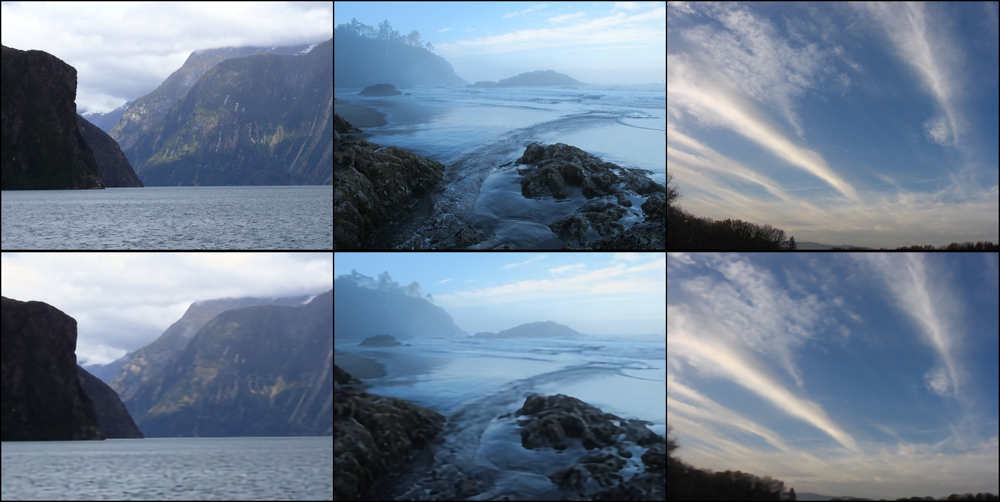
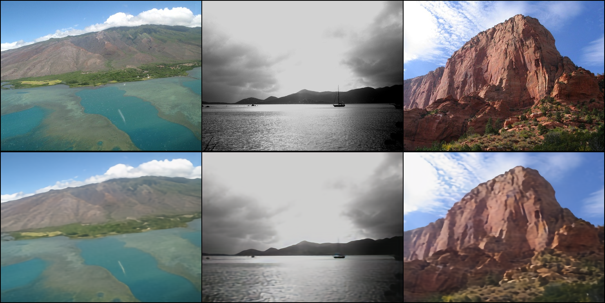
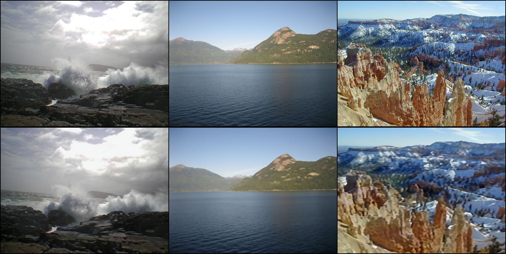
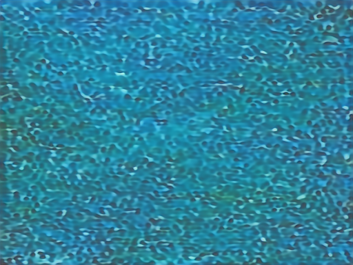
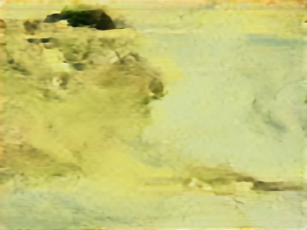
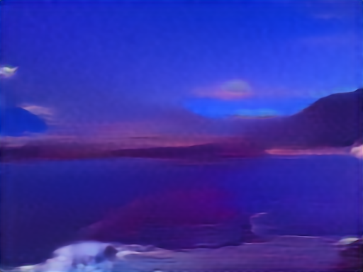

# guided--landscape-imageGen-diffusion
*使用 [中文](README.md) 阅读*

## Attention
### Q
The project will no longer be updated. The reasons are: 
- Question 1: Issues have arisen in the model design.
- Question 2: Issues have occurred during model training.
- Question 3: Another similar image synthesis task is currently in progress, and the subsequent results of this similar task will be open-sourced.
### A
- A Q1: Redesign the model (align key-value dimensions, align masks).
- A Q2: Add mean-variance constraints to stage 1 training, and use a larger batch size (128) for averaging in stage 2.
- A Q3: Completed, awaiting open-source release.

## Introduction

image generation tasks have been very application scenario computer vision tasks, and there are still many challenges in generating meaningful, high-quality images from semantic segmentation graphs, such as ensuring the authenticity, clarity, diversity, and aesthetics of the generated images. Among them, conditional image synthesis, i.e., inputting image data and synthesizing realistic images, is widely used in the field of content generation and image editing. One way of conditional image synthesis is to use two images as input, which are processed and transformed to generate a new image, where one input is a semantic segmentation image (called mask graph) indicating the semantic information of the generated image (called gen graph), and the other input is a reference style image (called ref graph) indicating the style information of the gen graph in terms of hue and other aspects

Reference: https://www.educoder.net/competitions/Jittor-4

## Training data

The Graphics Laboratory of the Computer Science and Technology Department at Tsinghua University collected 12,000 high-definition (width: 512, height: 384) landscape images from the Flickr official website and created semantic segmentation maps for them. Among them, 10,000 pairs of images were used for training.**In these images, the label is a grayscale image with values ranging from 0 to 28.**

The signs include 29 categories of objects, respectively:
```
"mountain", "sky", "water", "sea", "rock", "tree", "earth", "hill", "river", "sand", "land", "building", "grass", "plant", "person", "boat", "waterfall", "wall", "pier", "path", "lake", "bridge", "field", "road", "railing", "fence", "ship", "house", "other" 
```

## Architecture(Old)


## Architecture(New)


## Training

Environment: RTX4090 24G, Tesla V100 32G, Tesla A100 80G respectively

Training time:In RTX4090,V100,A100, training vae one epoch about 1.5-2h, training unet one epoch about 2-2.5h

Training commands: <code>python3 MainTrain.py</code>

Testing commands: <code>python3 MainTest.py</code>

## Note
1. Code is not completed
2. In stage2, unet trained normally, fixed the vae trained in stage1

## Training procedure
### VAE
#### 0-2 epoch
- batch size = 1 
- loss fun: L1loss
- gradient accumulation batch = 4
- optimizer = AdamW(train_lr = 1e-5, adam_betas = (0.5, 0.999), weight_decay=0.01, eps=1e-8)
- step0:<div align=center></div>
- step100:<div align=center></div>
- step20000:<div align=center></div>
#### 3-8 epoch
- batch size = 2 
- loss fun: L1loss
- gradient accumulation batch = 4
- optimizer = AdamW(train_lr = 1e-5, adam_betas = (0.5, 0.9), weight_decay=0.01, eps=1e-8)
- step10000:
- step30000:
- step35000:
- step40000:
#### 9-20 epoch
- batch size = 3 
- loss fun: L1loss
- gradient accumulation batch = 1
- optimizer = AdamW(train_lr = 1e-4, adam_betas = (0.9, 0.999), weight_decay=0.01, eps=1e-8)
- step28000:
- step29900:
- step48000:
- step50000:

#### 21-100 epoch
- batch size = 3
- loss fun: L1loss
- gradient accumulation batch = 1
- optimizer = AdamW(train_lr = 5e-5, adam_betas = (0.9, 0.999), weight_decay=0.01, eps=1e-8)
- lr_scheduler = exp

- step55000:
- step63000:
- step68000:
- step160000:
- step163200:

### uncondtional Unet
oh bad
#### -200 epoch
- batch size = 1
- loss fun: L1loss
- gradient accumulation batch = 4
- optimizer = AdamW(train_lr = 1e-4, adam_betas = (0.9, 0.999), weight_decay=0.01, eps=1e-8)
- lr_scheduler = exp
- rtx3090 * 4

- step3200:
- step3300:
- step23100:
- step23200:
- step37800:
- step37900:
- step43800:
- step43900:
- step115600:
- step115700:
- step115800:

## TODO
1. Adding modules for learning rate adjustment
2. Apply continuous super-resolution to the generated Gen
3. Using ControlNet with LoRA
